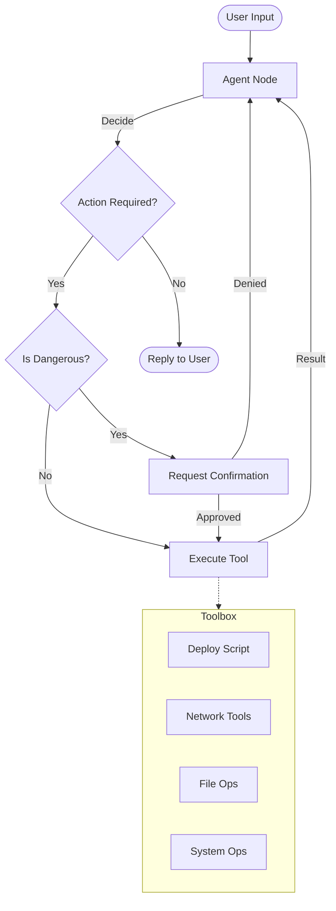

# 🤖 zkzkAgent: Local AI System Manager


**zkzkAgent** is a powerful, privacy-focused local AI assistant designed to act as your intelligent system manager. Built on **LangGraph** and **Ollama**, it automates complex workflows, manages system processes, and handles network tasks—all while keeping your data on your machine.

---

## ✨ Key Features

### 🧠 Intelligent Automation

- **Background Deployment**: Run long-running deployment scripts in the background. The agent monitors the process, logs output to files, and notifies you upon completion.
- **Process Management**: Track and kill background processes directly through chat commands.

### 🌐 Network Awareness

- **Auto-Connectivity Check**: Automatically verifies internet access before executing network-dependent tasks.
- **Self-Healing Wi-Fi**: Detects disconnections and attempts to enable Wi-Fi automatically to restore service.

### 🛡️ Safety & Security

- **Human-in-the-Loop**: Destructive operations (like emptying trash or clearing temp files) require explicit user confirmation.
- **Local Execution**: Powered by local LLMs (default: `qwen3-vl`) via Ollama, ensuring your data never leaves your device.

### 🛠️ Modular Tooling

- **File Operations**: Read, find, and manage files.
- **Browser Automation**: Open URLs in your default web browser.
- **IDE Integration**: Open Visual Studio Code directly from the chat.
- **System Maintenance**: Clean up system trash and temporary files.

---

## 🏗️ Architecture

The agent operates on a cyclic graph architecture using **LangGraph**.



---

## 🚀 Getting Started

### Prerequisites

- **Python 3.10+**
- **Ollama**: Installed and running locally.
  - Pull the default model: `ollama pull qwen3-vl:4b-instruct-q4_K_M`
  - _Note: You can change the model in `models/LLM.py`._

### Installation

1.  **Clone the Repository**

    ```bash
    git clone https://github.com/zkzkGamal/zkzkAgent.git
    cd zkzkAgent
    ```

2.  **Install Dependencies**
    ```bash
    pip install -r requirements.txt
    ```

### Configuration

- **System Prompt**: Customize the agent's personality and rules in `prompt.yaml`.
- **Model Settings**: Adjust model parameters in `models/LLM.py`.

---

## 💻 Usage

Start the agent:

```bash
python3 main.py
```

### Example Commands

| Category       | Command                    | Description                                     |
| :------------- | :------------------------- | :---------------------------------------------- |
| **Deployment** | _"Run the deploy script"_  | Starts deployment in background.                |
| **Process**    | _"Kill the deploy script"_ | Terminates the background process.              |
| **Network**    | _"Open youtube.com"_       | Checks net, enables Wi-Fi if needed, opens URL. |
| **System**     | _"Empty the trash"_        | Asks for confirmation, then cleans trash.       |
| **General**    | _"Read file main.py"_      | Reads and displays file content.                |

---

## 📂 Project Structure

```text
zkzkAgent/
├── agent.py              # Core LangGraph agent logic & graph definition
├── main.py               # Entry point & CLI loop
├── state.py              # AgentState definition (TypedDict)
├── tools.py              # Tool exports & registration
├── prompt.yaml           # System prompt configuration
├── requirements.txt      # Python dependencies
├── models/               # LLM configuration
│   └── LLM.py
├── modules/              # Auxiliary modules
│   └── voice_module.py   # Experimental voice input support
└── tools_module/         # Individual tool implementations
    ├── dangerous_tools/  # Tools requiring confirmation (trash, tmp)
    ├── killProcess.py    # Process management
    ├── network_tools.py  # Connectivity & Wi-Fi
    ├── openBrowser.py    # Web navigation
    └── runDeployScript.py# Background deployment
```

---

## 🤝 Contributing

Contributions are welcome! Please feel free to submit a Pull Request.

## 📄 License

This project is licensed under the MIT License.
