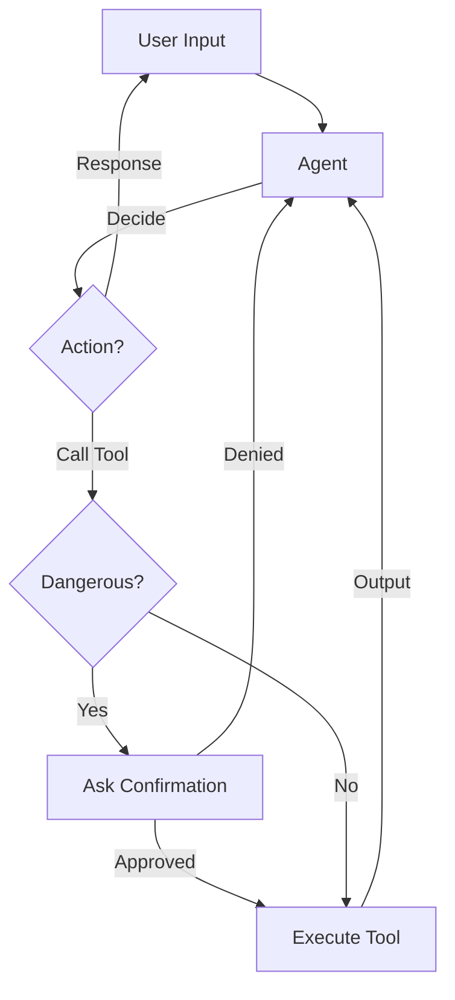

# Local AI Assistant

A modular, local AI assistant built with **LangGraph** and **LangChain**, powered by **Ollama**. This agent can perform file operations, run deployment scripts, and execute system commands with a built-in safety mechanism for dangerous operations.

## Features

- **Local LLM Support**: Uses Ollama (default model: `qwen3-vl:4b-instruct-q4_K_M`) for privacy and offline capability.
- **Modular Architecture**: Clean separation of concerns (Agent, Tools, State).
- **Tool Use**:
  - `read_file`: Read file contents.
  - `run_deploy_script`: Automated deployment with background execution and logging.
  - `kill_process`: Terminate running background processes.
  - `check_internet` & `enable_wifi`: Ensure network connectivity.
  - `open_browser`: Open URLs in the default browser.
  - `open_vscode`: Open Visual Studio Code.
  - `empty_trash`: Empty system trash (requires confirmation).
  - `clear_tmp`: Clear temporary files (requires confirmation).
- **Safety First**: Dangerous tools require explicit user confirmation before execution.
- **Interactive Loop**: Continuous chat interface with the agent.

## Workflow



## Prerequisites

- **Python 3.10+**
- **Ollama**: Installed and running.
  - Pull the model: `ollama pull qwen3-vl:4b-instruct-q4_K_M` (or update `agent.py` to use your preferred model).

## Installation

1.  Clone the repository:

    ```bash
    git clone <repository-url>
    cd zkzkAgent
    ```

2.  Install dependencies:
    ```bash
    pip install langchain langgraph langchain-ollama pydantic typing-extensions
    ```

## Usage

Run the agent:

```bash
python3 main.py
```

### Example Interaction

```text
AI Assistant Ready. Type 'exit' or 'quit' to stop.
Enter your request: read file main.py

[AI]: The file content is ...
```

## Project Structure

- **`main.py`**: Entry point. Handles the user input loop and initializes the agent.
- **`agent.py`**: Defines the LangGraph agent, including the decision logic and confirmation safeguards.
- **`tools.py`**: Contains the definitions for all tools available to the agent.
- **`state.py`**: Defines the `AgentState` using `TypedDict` for type safety.

## Customization

- **Change Model**: Edit `agent.py` and `tools.py` (if applicable) to change the `model` parameter in `ChatOllama`.
- **Add Tools**: Define new tools in `tools.py` and add them to the `tools` list in `agent.py`.
