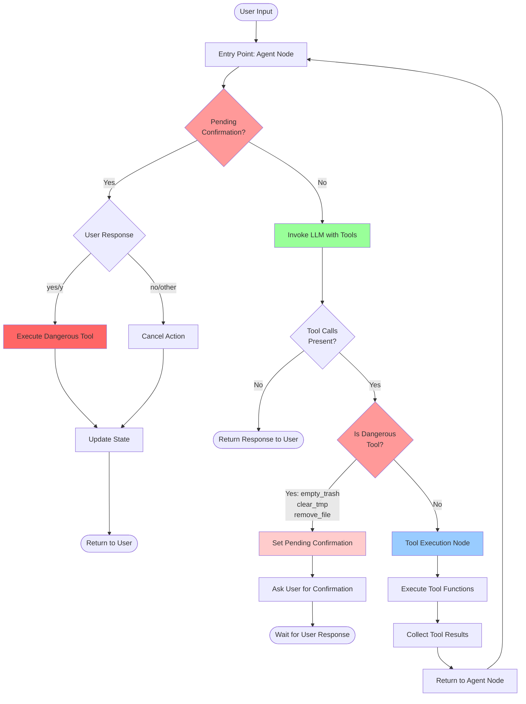
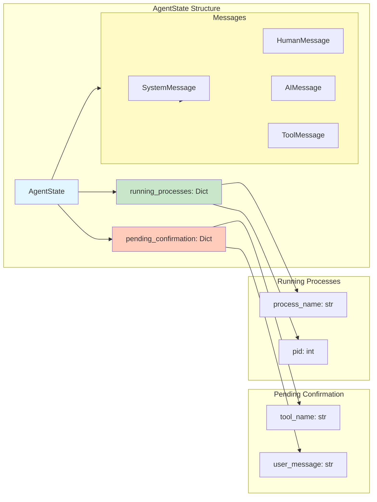
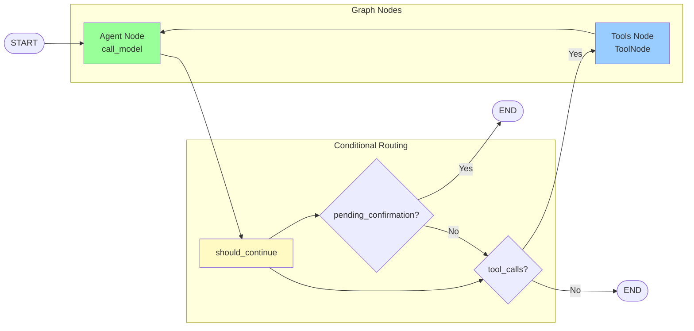
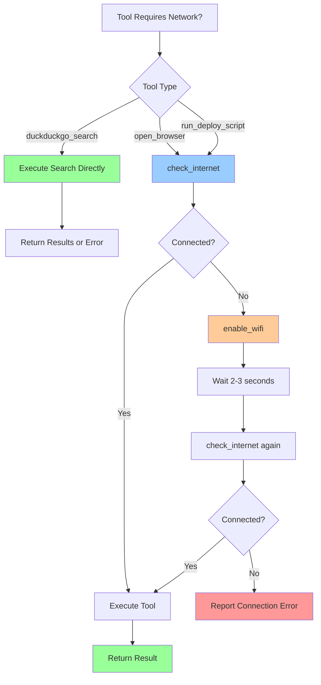

# 🤖 zkzkAgent: Local AI System Manager for Linux


> ⚠️ **Linux Only**: This project is specifically designed for Linux systems (Ubuntu/Debian-based distributions). It uses Linux-specific commands and tools like `nmcli`, `xdg-open`, and system paths.

**zkzkAgent** is a powerful, privacy-focused local AI assistant designed to act as your intelligent system manager on Linux. Built on **LangGraph** and **Ollama**, it automates complex workflows, manages system processes, handles network tasks, and provides voice interaction capabilities—all while keeping your data on your machine.

---

## ✨ Key Features

### 🧠 Intelligent Automation

- **Background Deployment**: Run long-running deployment scripts in the background with automatic option selection by AI
- **Process Management**: Track, monitor, and kill background processes directly through chat commands
- **Smart File Search**: Automatic wildcard matching when exact filenames aren't found
- **Context-Aware Actions**: AI reads scripts and makes intelligent decisions based on user intent

### 🌐 Network Awareness

- **Auto-Connectivity Check**: Automatically verifies internet access before executing network-dependent tasks
- **Self-Healing Wi-Fi**: Detects disconnections and attempts to enable Wi-Fi automatically using `nmcli`
- **Network-First Operations**: Browser and deployment tasks always check connectivity first

### 🛡️ Safety & Security

- **Human-in-the-Loop**: Destructive operations require explicit user confirmation (yes/no)
- **Dangerous Tool Protection**: Automatic safeguards for `empty_trash`, `clear_tmp`, and `remove_file`
- **Local Execution**: Powered by local LLMs via Ollama—your data never leaves your device
- **Privacy-First**: No cloud dependencies, all processing happens locally

### 🎤 Voice Interaction (Optional)

- **Voice Input**: Whisper-based speech recognition with VAD (Voice Activity Detection)
- **Text-to-Speech**: Natural voice responses using Coqui TTS
- **Noise Reduction**: Built-in audio preprocessing for better recognition
- **Hands-Free Operation**: Control your system with voice commands

### 🛠️ Comprehensive Tooling (22 Tools)

#### File Operations (8 tools)

**General File Tools (4 tools)**

- **Find File** (`find_file`): Search for files with automatic wildcard matching
- **Find Folder** (`find_folder`): Locate directories across your system
- **Read File** (`read_file`): Display file contents
- **Open File** (`open_file`): Open files with default applications using `xdg-open`

**Coding & Project Tools (4 tools - New)**

- **Get File Content** (`get_file_content`): Read code files within a project limit 10000 chars
- **Write File** (`write_file`): Write code to files within a project limit 10000 chars
- **Get Files Info** (`get_files_info`): List files and directories with metadata
- **Create Project** (`create_project_folder`): Create new project directories safely

#### Dangerous Tools (3 tools - Require Confirmation)

- **Empty Trash** (`empty_trash`): Clear system trash (`~/.local/share/Trash/*`)
- **Clear Temp** (`clear_tmp`): Remove temporary files from `~/tmp/*`
- **Remove File** (`remove_file`): Safely delete files/folders permanently

#### Application Tools (2 tools)

- **VSCode Integration** (`open_vscode`): Open files and folders in Visual Studio Code
- **Browser Automation** (`open_browser`): Open URLs in default browser

#### Network Tools (3 tools)

- **Internet Check** (`check_internet`): Verify connectivity by pinging `8.8.8.8`
- **Wi-Fi Management** (`enable_wifi`): Enable Wi-Fi using NetworkManager (`nmcli`)
- **Web Search** (`duckduckgo_search`): Search the web using DuckDuckGo API

#### Process Management Tools (2 tools)

- **Find Process** (`find_process`): Locate running processes by name using `pgrep`
- **Kill Process** (`kill_process`): Terminate background processes with SIGTERM

#### Deployment Tools (2 tools)

- **Deploy Script** (`run_deploy_script`): Run deployment scripts with AI-assisted option selection
- **Stop Frontend** (`stop_frontend`): Terminate remote frontend process via SSH

#### System Tools (2 tools)

- **Run Command** (`run_command`): Execute shell commands and return output (date, whoami, ls, etc.)

---

## 🏗️ Architecture

The agent operates on a **cyclic graph architecture** using **LangGraph** with stateful execution, conditional routing, and human-in-the-loop safety mechanisms.

### High-Level Agent Flow



### Detailed State Management



### Tool Execution Flow

```mermaid
graph TD
    ToolCall[Tool Call Received] --> RouteType{Tool Type}

    %% File Operations
    RouteType -->|File Ops| FileFlow[File Operations Flow]
    FileFlow --> FindFile[find_file: Search with wildcards]
    FileFlow --> FindFolder[find_folder: Locate directories]
    FileFlow --> ReadFile[read_file: Display contents]
    FileFlow --> OpenFile[open_file: xdg-open]

    %% Coding Operations
    RouteType -->|Coding| CodeFlow[Coding Operations Flow]
    CodeFlow --> CreateProj[create_project_folder: Init Project]
    CodeFlow --> WriteMs[write_file: Write Code]
    CodeFlow --> ReadCode[get_file_content: Read Code]
    CodeFlow --> ListFiles[get_files_info: List Project Files]

    %% Network Operations
    RouteType -->|Network| NetworkFlow[Network Operations Flow]
    NetworkFlow --> CheckInternet[check_internet: Ping 8.8.8.8]
    NetworkFlow --> EnableWiFi[enable_wifi: nmcli radio wifi on]
    NetworkFlow --> WebSearch[duckduckgo_search: Query DuckDuckGo API]

    %% Application Tools
    RouteType -->|Applications| AppFlow[Application Tools Flow]
    AppFlow --> OpenVSCode[open_vscode: Launch IDE]
    AppFlow --> OpenBrowser[open_browser: xdg-open URL]

    %% Process Management
    RouteType -->|Process| ProcFlow[Process Management Flow]
    ProcFlow --> FindProc[find_process: pgrep process_name]
    ProcFlow --> KillProc[kill_process: SIGTERM]

    %% Deployment Tools
    RouteType -->|Deployment| DeployFlow[Deployment Tools Flow]
    DeployFlow --> RunDeploy[run_deploy_script: Background execution]
    DeployFlow --> StopFrontend[stop_frontend: Kill remote frontend]

    %% System Tools
    RouteType -->|System| SysFlow[System Commands Flow]
    SysFlow --> RunCommand[run_command: Execute shell command]

    %% Dangerous Operations
    RouteType -->|Dangerous| DangerFlow[Dangerous Operations Flow]
    DangerFlow --> Confirm{User<br/>Confirmed?}
    Confirm -->|Yes| EmptyTrash[empty_trash: rm -rf ~/.local/share/Trash/*]
    Confirm -->|Yes| ClearTmp[clear_tmp: rm -rf ~/tmp/*]
    Confirm -->|Yes| RemoveFile[remove_file: rm -rf path]
    Confirm -->|No| Cancel[Cancel Operation]

    %% Results
    FindFile --> Result[Return Result to Agent]
    FindFolder --> Result
    ReadFile --> Result
    OpenFile --> Result
    CreateProj --> Result
    WriteMs --> Result
    ReadCode --> Result
    ListFiles --> Result
    CheckInternet --> Result
    EnableWiFi --> Result
    WebSearch --> Result
    OpenVSCode --> Result
    OpenBrowser --> Result
    FindProc --> Result
    KillProc --> Result
    RunDeploy --> Result
    StopFrontend --> Result
    RunCommand --> Result
    EmptyTrash --> Result
    ClearTmp --> Result
    RemoveFile --> Result
    Cancel --> Result

    style DangerFlow fill:#ff9999
    style Confirm fill:#ffcccc
    style EmptyTrash fill:#ff6666
    style ClearTmp fill:#ff6666
    style RemoveFile fill:#ff6666
    style NetworkFlow fill:#99ccff
    style FileFlow fill:#c8e6c9
    style CodeFlow fill:#a5d6a7
    style AppFlow fill:#fff9c4
    style ProcFlow fill:#e1bee7
    style DeployFlow fill:#b2dfdb
    style SysFlow fill:#ffccbc
```



### LangGraph Node Structure



### Internet Connectivity Workflow



---

## 🚀 Getting Started

### System Requirements

- **Operating System**: Linux (Ubuntu 20.04+, Debian-based distributions)
- **Python**: 3.10 or higher
- **RAM**: Minimum 8GB (16GB recommended for voice features)
- **Disk Space**: ~5GB for models and dependencies
- **GPU**: Optional (CUDA support for faster TTS)

### Prerequisites

#### 1. Install Ollama

```bash
# Download and install Ollama
curl -fsSL https://ollama.com/install.sh | sh

# Pull the default model
ollama pull qwen3-vl:4b-instruct-q4_K_M
```

> **Note**: You can use any Ollama model. Edit `models/LLM.py` to change the model.

#### 2. Install System Dependencies

```bash
# For Ubuntu/Debian
sudo apt update
sudo apt install -y python3-pip python3-dev portaudio19-dev ffmpeg

# NetworkManager (usually pre-installed)
sudo apt install -y network-manager
```

### Installation

1. **Clone the Repository**

   ```bash
   git clone https://github.com/zkzkGamal/zkzkAgent.git
   cd zkzkAgent
   ```

2. **Create Virtual Environment** (Recommended)

   ```bash
   python3 -m venv venv
   source venv/bin/activate
   ```

3. **Install Python Dependencies**

   ```bash
   pip install -r requirements.txt
   ```

### Configuration

#### System Prompt (`prompt.yaml`)

Customize the agent's behavior, personality, and rules:

```yaml
_type: chat
input_variables:
  - home

messages:
  - role: system
    prompt:
      template: |
        You are a local AI assistant acting as a **system manager**.
        # ... customize your prompt here
```

#### Model Settings (`models/LLM.py`)

Change the LLM model:

```python
from langchain_ollama import ChatOllama

llm = ChatOllama(model="qwen3-vl:4b-instruct-q4_K_M")  # Change model here
```

#### Voice Settings

- **Voice Input** (`models/voice.py`): Change Whisper model size (`tiny`, `base`, `small`, `medium`, `large`)
- **TTS** (`models/tts.py`): Change TTS model or speaker voice

---

## 💻 Usage

### Text Mode (Default)

Start the agent with text input:

```bash
python3 main.py
```

Type your commands and press Enter. Type `exit` or `quit` to stop.

### Voice Mode (Optional)

Uncomment the voice input lines in `main.py`:

```python
# Change from:
user_input = input("Enter your request: ").strip()

# To:
logger.info("Listening for voice input...")
user_input = voice_module()
if user_input is None:
    logger.info("No valid input detected. Please try again.")
    continue
logger.info(f"[USER]: {user_input}")
```

---

## 📖 Comprehensive Usage Examples

### File Operations

#### Finding Files

```
User: Find the file main.py
AI: [Searches and returns file path]

User: Find config file
AI: [Automatically tries *config* wildcard search]

User: Find all Python files in the project
AI: [Uses find_file with *.py pattern]
```

#### Reading Files

```
User: Read the readme file
AI: [Finds and displays README.md content]

User: Show me the contents of agent.py
AI: [Displays agent.py content]
```

#### Opening Files

```
User: Open main.py
AI: [Opens in default text editor using xdg-open]

User: Open setup.py in VSCode
AI: [Uses open_vscode tool to open in VSCode]
```

### Coding & Project Management

#### creating New Projects

```
User: Create a new Python project called 'ai-bot'
AI: [Uses create_project_folder("~/", "ai-bot") → Creates new directory]
```

#### Writing and Reading Code

```
User: Create main.py in myapp with a hello world script
AI: [Uses write_file("~/myapp", "main.py", "print('Hello')") → Writes content]

User: Read the content of src/utils.py
AI: [Uses get_file_content("~/myapp", "src/utils.py") → Returns code content]
```

#### Explroing Project Structure

```
User: what files are in the current project?
AI: [Uses get_files_info("~/myapp", ".") → Lists files with metadata]
```

### System Maintenance

#### Cleaning System

```
User: Empty the trash
AI: I'm about to perform 'empty_trash'. This will delete data permanently. Please confirm with 'yes' or 'no'.
User: yes
AI: [Empties ~/.local/share/Trash]

User: Clear temporary files
AI: I'm about to perform 'clear_tmp'. This will delete data permanently. Please confirm with 'yes' or 'no'.
User: yes
AI: [Clears /tmp directory]
```

#### File Removal

```
User: Remove old_backup.tar.gz
AI: I'm about to perform 'remove_file'. This will delete data permanently. Please confirm with 'yes' or 'no'.
User: yes
AI: [Deletes the file]
```

### Network Operations

#### Opening URLs

```
User: Open youtube.com
AI: [Checks internet → Enables Wi-Fi if needed → Opens in browser]

User: Browse github.com
AI: [Verifies connectivity → Opens URL]
```

#### Network Troubleshooting

```
User: Check if I'm connected to the internet
AI: [Uses check_internet tool → Reports status]

User: Enable Wi-Fi
AI: [Uses nmcli to enable Wi-Fi]
```

### Development Workflow

#### Opening Projects

```
User: Open the current project in VSCode
AI: [Launches VSCode with current directory]

User: Open /home/user/myproject in VSCode
AI: [Opens specified directory in VSCode]
```

#### Running Deployments

```
User: Run the deploy script
AI: [Reads deploy_v2.sh → Analyzes options → Selects appropriate option → Runs in background]
AI: Deploy script started in background. PID: 12345. Logs are being written to deploy.log.

User: Kill the deploy script
AI: [Terminates process 12345]
```

### Process Management

```
User: Find all Python processes
AI: [Uses find_process tool with 'python']
AI: Found the following Python processes:
    - PID: 92550
    - PID: 92560
    - PID: 96142

User: List all running processes
AI: [Uses find_process to locate processes]

User: Kill the deploy script
AI: [Finds and terminates the background deployment process]

User: Stop process 12345
AI: [Terminates the specified process using kill_process]
```

### Combined Workflows

```
User: Find the config file, read it, and open it in VSCode
AI: [Executes find_file → read_file → open_vscode in sequence]

User: Check internet and open the project documentation
AI: [Checks connectivity → Enables Wi-Fi if needed → Opens URL]
```

### Web Search

```
User: Search for Python best practices
AI: [Uses duckduckgo_search tool → Returns top 5 results with titles, descriptions, and URLs]

User: Find information about LangGraph framework
AI: [Searches web and presents results with clickable links]

User: Look up the latest news about AI agents
AI: [Executes duckduckgo_search("AI agents news", 5) → Displays formatted results]
```

### System Commands

```
User: What's the current date?
AI: [Uses run_command("date") → Returns current date and time]

User: Show me the current user
AI: [Uses run_command("whoami") → Returns username]

User: Check disk space
AI: [Uses run_command("df -h") → Returns disk usage information]

User: Show system information
AI: [Uses run_command("uname -a") → Returns kernel and system details]
```

### Frontend Management

```
User: Stop the frontend
AI: [Uses stop_frontend() → Terminates remote frontend process]
AI: Frontend stopped successfully. PID 12345 killed on remote server.

User: Kill the frontend deployment
AI: [Checks running_processes state → Uses stop_frontend() → Reports success]
```

---

## 📂 Project Structure

```text
zkzkAgent/
├── main.py                     # Entry point & CLI loop with logging
├── prompt.yaml                 # System prompt configuration
├── requirements.txt            # Python dependencies
│
├── core/                       # Core agent components
│   ├── __init__.py
│   ├── agent.py                # LangGraph agent logic & graph definition
│   ├── state.py                # AgentState TypedDict definition
│   └── tools.py                # Tool exports & registration
│
├── models/                     # AI Model configurations
│   ├── LLM.py                  # Ollama LLM setup (qwen3-vl)
│   ├── voice.py                # Whisper model for voice input
│   └── tts.py                  # Coqui TTS for voice output
│
├── modules/                    # Auxiliary modules
│   └── voice_module.py         # Voice input processing with VAD
│
└── tools_module/               # Tool implementations (22 tools)
    ├── __init__.py
    │
    ├── files_tools/            # File operation tools (8 tools)
    │   ├── findFile.py         # Search for files with wildcards
    │   ├── findFolder.py       # Search for directories
    │   ├── readFile.py         # Read file contents
    │   ├── openFile.py         # Open files with xdg-open
    │   ├── getFileContent.py   # Read code files (coding tool)
    │   ├── writeFile.py        # Write code files (coding tool)
    │   ├── getFileInfo.py      # List file metadata (coding tool)
    │   └── createProjectFolder.py # Create project directories
    │
    ├── dangerous_tools/        # Tools requiring confirmation (3 tools)
    │   ├── __init__.py
    │   ├── emptyTrash.py       # Empty ~/.local/share/Trash/*
    │   ├── emptyTmp.py         # Clear ~/tmp/*
    │   └── removeFile.py       # Delete files/folders safely
    │
    ├── applications_tools/     # Application launchers (2 tools)
    │   ├── openVsCode.py       # Launch Visual Studio Code
    │   └── openBrowser.py      # Open URLs in default browser
    │
    ├── network_tools/          # Network management (3 tools)
    │   ├── checkInternet.py    # Verify connectivity (ping 8.8.8.8)
    │   ├── enableWifi.py       # Enable Wi-Fi using nmcli
    │   └── networkSearch.py    # DuckDuckGo web search
    │
    ├── processes_tools/        # Process management (2 tools)
    │   ├── findProcess.py      # Find processes by name (pgrep)
    │   └── killProcess.py      # Terminate processes (SIGTERM)
    │
    ├── runDeployScript.py      # Deployment tools (2 tools: run_deploy_script, stop_frontend)
    └── runCommand.py           # System command execution (1 tool: run_command)
```

---

## 🔧 Advanced Configuration

### Custom Tools

Add new tools by creating a new file in `tools_module/`:

```python
from langchain_core.tools import tool

@tool
def my_custom_tool(param: str) -> str:
    """Description of what this tool does."""
    # Your implementation
    return "Result"
```

Register in `tools.py`:

```python
from tools_module import my_custom_tool

__all__ = [
    # ... existing tools
    my_custom_tool.my_custom_tool,
]
```

### Dangerous Tools

To add a tool that requires confirmation, add its name to `agent.py`:

```python
DANGEROUS_TOOLS = ["empty_trash", "clear_tmp", "remove_file", "my_dangerous_tool"]
```

### Voice Configuration

#### Whisper Model Size

Edit `models/voice.py`:

```python
# Options: tiny, base, small, medium, large
whisper_model = whisper.load_model("small", device="cpu").cpu()
```

#### TTS Voice

Edit `models/tts.py`:

```python
# Change speaker index (0-108 for VCTK model)
speaker = tts.speakers[11]  # Try different numbers
```

---

## 🐛 Troubleshooting

### Common Issues

#### 1. Ollama Connection Error

```bash
# Check if Ollama is running
ollama list

# Restart Ollama service
systemctl restart ollama
```

#### 2. NetworkManager Not Found

```bash
# Install NetworkManager
sudo apt install network-manager

# Enable and start service
sudo systemctl enable NetworkManager
sudo systemctl start NetworkManager
```

#### 3. Audio Issues (Voice Mode)

```bash
# Install PortAudio
sudo apt install portaudio19-dev

# Test audio devices
python3 -c "import sounddevice as sd; print(sd.query_devices())"
```

#### 4. Permission Denied for Tools

```bash
# Make deploy script executable
chmod +x ../deploy/deploy_v2.sh

# Check file permissions
ls -la ~/.local/share/Trash
```

#### 5. VSCode Not Opening

```bash
# Install VSCode
sudo snap install code --classic

# Or via apt
wget -qO- https://packages.microsoft.com/keys/microsoft.asc | gpg --dearmor > packages.microsoft.gpg
sudo install -o root -g root -m 644 packages.microsoft.gpg /etc/apt/trusted.gpg.d/
sudo sh -c 'echo "deb [arch=amd64] https://packages.microsoft.com/repos/vscode stable main" > /etc/apt/sources.list.d/vscode.list'
sudo apt update
sudo apt install code
```

---

## 📊 Performance Tips

### Optimize for Speed

1. **Use Smaller Models**: Switch to `qwen3-vl:2b` for faster responses
2. **Disable Voice**: Comment out TTS in `main.py` for text-only mode
3. **GPU Acceleration**: Enable GPU for TTS in `models/tts.py`:
   ```python
   tts = TTS(model_name, progress_bar=False, gpu=True)
   ```

### Reduce Memory Usage

1. **Use Quantized Models**: Stick with `q4_K_M` quantization
2. **Smaller Whisper**: Use `tiny` or `base` model
3. **Disable Unused Features**: Remove voice dependencies if not needed

---

## 🔒 Security Considerations

- **Local Only**: All processing happens on your machine
- **No Telemetry**: No data is sent to external servers
- **Confirmation Required**: Destructive operations need explicit approval
- **Script Inspection**: AI reads scripts before execution
- **Process Isolation**: Background processes run with user permissions

---

## 🤝 Contributing

Contributions are welcome! Please follow these guidelines:

1. Fork the repository
2. Create a feature branch (`git checkout -b feature/amazing-feature`)
3. Commit your changes (`git commit -m 'Add amazing feature'`)
4. Push to the branch (`git push origin feature/amazing-feature`)
5. Open a Pull Request

### Development Setup

```bash
# Install development dependencies
pip install -r requirements.txt

# Run tests
python3 tools_test.py
```

---

## 📄 License

This project is licensed under the MIT License. See the LICENSE file for details.

---

## 🙏 Acknowledgments

- **LangChain** & **LangGraph**: For the agent framework
- **Ollama**: For local LLM inference
- **OpenAI Whisper**: For speech recognition
- **Coqui TTS**: For text-to-speech synthesis
- **NetworkManager**: For Wi-Fi management on Linux

---

## 📞 Support

For issues, questions, or feature requests:

- **GitHub Issues**: [Create an issue](https://github.com/zkzkGamal/zkzkAgent/issues)
- **Discussions**: [Join the discussion](https://github.com/zkzkGamal/zkzkAgent/discussions)

---

**Made with ❤️ for the Linux community**
