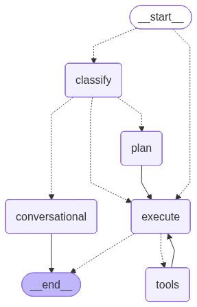
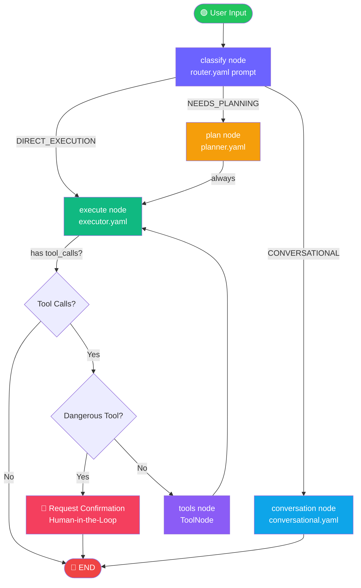

# 🤖 zkzkAgent — Intelligent Local AI System Manager for Linux

<div align="center">


**A privacy-first, fully local AI agent that thinks before it acts — built with LangGraph's multi-node router architecture.**

</div>

This repository implements a multi-node LangGraph/StateGraph runtime that mirrors the routing, state management, and tool-gating patterns I build in production. The architecture maps directly to systems I developed at Alohadot and ThePost, including multi-agent orchestration and LLM routing across vLLM/SGLang/OpenAI/Gemini. Use this local runtime to prototype and validate production-grade agent behaviors on Linux.

> ⚠️ **Linux Only**: Designed for Linux (Ubuntu/Debian-based). Uses Linux-specific tools like `nmcli`, `xdg-open`, and system paths.

---

## 🎬 Demos

<div align="center">
  <a href="https://www.youtube.com/shorts/eC5XbqPbzSY">
    
  </a>
  <br/><em>Demo Video 1</em>
  <br/><br/>
  <a href="https://www.youtube.com/shorts/D0dmyMQFHUs">
    
  </a>
  <br/><em>Demo Video 2</em>
</div>

---

## 📑 Table of Contents

- [✨ Key Features](#-key-features)
- [🏗️ Architecture — Router & Conditional Branching](#️-architecture--router--conditional-branching)
- [🚀 Quick Install](#-quick-install)
- [🚀 Getting Started](#-getting-started)
- [💻 Usage](#-usage)
- [📖 Usage Examples](#-usage-examples)
- [📂 Project Structure](#-project-structure)
- [🔧 Advanced Configuration](#-advanced-configuration)
- [🐛 Troubleshooting](#-troubleshooting)
- [📊 Performance Tips](#-performance-tips)
- [🔒 Security](#-security)
- [🤝 Contributing](#-contributing)
- [📄 License](#-license)

---

## ✨ Key Features

### 🧠 Smart Multi-Path Reasoning (New Architecture)

zkzkAgent doesn't just blindly execute your commands — it **classifies your intent first**, then picks the optimal execution path:

- **Conversational Path**: Direct answers to questions with no tool overhead
- **Direct Execution Path**: Immediate tool dispatch for clear, single-step tasks
- **Planning Path**: Multi-step task decomposition before execution — catches hidden dependencies

### ⚡ Intelligent Automation

- **Background Deployment**: Run long-running scripts in the background with AI-assisted option selection
- **Process Management**: Track, monitor, and terminate background processes via chat
- **Smart File Search**: Automatic wildcard matching when exact filenames aren't found
- **Real-time Streaming**: Token-by-token response streaming for instant feedback
- **Low-latency Startup**: Adaptive warm-up ensures the agent is ready when you are

### 🌐 Network Awareness

- **Auto-Connectivity Check**: Verifies internet access before any network-dependent task
- **Self-Healing Wi-Fi**: Detects disconnections and auto-enables Wi-Fi via `nmcli`

### 🛡️ Human-in-the-Loop Safety

- **Confirmation Gates**: Destructive operations require explicit `yes/no` before execution
- **Dangerous Tool Protection**: Safeguards for `empty_trash`, `remove_file`, `install_package`, and more
- **Local Execution**: Fully offline — your data never leaves your machine

### 🎤 Voice Interaction (Optional)

- **Voice Input**: Whisper-based speech recognition with Voice Activity Detection (VAD)
- **Text-to-Speech**: Natural voice responses via Coqui TTS / Kokoro
- **Noise Reduction**: Built-in audio preprocessing for accurate recognition

### 🛠️ Comprehensive Tooling (25 Tools)

| Category                              | Tools                                                                                                                             |
| ------------------------------------- | --------------------------------------------------------------------------------------------------------------------------------- |
| **File Operations**                   | `find_file`, `find_folder`, `read_file`, `open_file`, `get_file_content`, `write_file`, `get_files_info`, `create_project_folder` |
| **Dangerous (Confirmation Required)** | `empty_trash`, `clear_tmp`, `remove_file`, `install_package`, `remove_package`                                                    |
| **Applications**                      | `open_vscode`, `open_browser`                                                                                                     |
| **Network**                           | `check_internet`, `enable_wifi`, `duckduckgo_search`, `duckduckgo_search_images`                                                  |
| **Process Management**                | `find_process`, `kill_process`                                                                                                    |
| **Deployment**                        | `run_deploy_script`, `stop_frontend`                                                                                              |
| **System**                            | `run_command`, `detect_operating_system`                                                                                          |

---

## 🏗️ Architecture — Router & Conditional Branching

> This is where zkzkAgent differs from a simple ReAct loop. Instead of feeding every request to a single LLM call, the agent uses a **multi-node LangGraph StateGraph** with a dedicated **Router** that classifies intent and conditionally branches to the right node. This makes the agent faster, safer, and more explainable.

### 📊 Live Graph — Compiled LangGraph



_Auto-generated from `app.get_graph().draw_mermaid_png()` — this is your actual compiled graph._

---

### 🔀 How the Router Works

Every user message enters the **`classify` node** first. A dedicated LLM (with no tools bound, just classification logic) reads the `router.yaml` prompt and returns a structured JSON decision:

```json
{
  "route": "DIRECT_EXECUTION | NEEDS_PLANNING | CONVERSATIONAL",
  "rationale": "Why this path was chosen."
}
```

This decision is stored in `AgentState.category`, and then **`add_conditional_edges`** routes to the correct node:

```python
graph.add_conditional_edges(
    "classify",
    route_after_classify,   # reads state["category"]
    {
        "execute":        "execute",       # DIRECT_EXECUTION
        "plan":           "plan",          # NEEDS_PLANNING
        "conversational": "conversational" # CONVERSATIONAL
    }
)
```

---

### 🗺️ Full Execution Flow


```mermaid
flowchart TD
    A([🟢 User Input]) --> B[classify node\nrouter.yaml prompt]

    B -->|CONVERSATIONAL| C[conversation node\nconversational.yaml]
    B -->|DIRECT_EXECUTION| D[execute node\nexecutor.yaml]
    B -->|NEEDS_PLANNING| E[plan node\nplanner.yaml]

    E -->|always| D

    D -->|has tool_calls?| F{Tool Calls?}
    F -->|Yes| G{Dangerous Tool?}
    F -->|No| Z([🔴 END])

    G -->|Yes| H[🛑 Request Confirmation\nHuman-in-the-Loop]
    H --> Z

    G -->|No| I[tools node\nToolNode]
    I --> D

    C --> Z

    style A fill:#22c55e,color:#fff
    style Z fill:#ef4444,color:#fff
    style B fill:#6C63FF,color:#fff
    style C fill:#0ea5e9,color:#fff
    style D fill:#10b981,color:#fff
    style E fill:#f59e0b,color:#fff
    style H fill:#f43f5e,color:#fff
    style I fill:#8b5cf6,color:#fff
```

---

### 🧩 Why This Architecture Wins

| Approach          | Single-Node ReAct         | zkzkAgent Multi-Node Router             |
| ----------------- | ------------------------- | --------------------------------------- |
| **Routing**       | LLM decides on every turn | Dedicated classifier — faster & cheaper |
| **Complex Tasks** | May miss dependencies     | `plan_node` decomposes first            |
| **Simple Chat**   | Unnecessarily calls tools | Directly answered via `conversational`  |
| **Safety**        | Ad-hoc                    | Explicit confirmation gate per node     |
| **Debuggability** | Black box                 | Each node logs its category & rationale |
| **Extensibility** | Hard to add paths         | Add a new node + one edge               |

---

### 🧱 Node Responsibilities

| Node             | Prompt File            | Responsibility                            |
| ---------------- | ---------------------- | ----------------------------------------- |
| `classify`       | `router.yaml`          | Classify intent → set `state["category"]` |
| `conversational` | `conversational.yaml`  | Direct Q&A, no tools bound                |
| `plan`           | `planner.yaml`         | Break complex tasks into steps            |
| `execute`        | `executor.yaml`        | Tool-calling agent with streaming         |
| `tools`          | _(LangGraph built-in)_ | Execute tool functions, return results    |

---

### 📦 AgentState — Shared Memory

```python
class AgentState(TypedDict):
    messages:             Annotated[Sequence[BaseMessage], add_messages]
    category:             Optional[Literal["DIRECT_EXECUTION", "NEEDS_PLANNING", "CONVERSATIONAL"]]
    pending_confirmation: Optional[Dict[str, Optional[str]]]  # Human-in-the-loop gate
    running_processes:    Optional[Dict[str, int]]             # Background process tracking
```

All nodes read from and write to this shared state — the graph is fully stateful across turns.

---

### ⚙️ The Two Routing Functions

**`route_after_classify`** — runs after `classify`, reads `state["category"]`:

```python
def route_after_classify(state: AgentState) -> str:
    category = state.get("category", "CONVERSATIONAL")
    if category == "DIRECT_EXECUTION": return "execute"
    elif category == "NEEDS_PLANNING":  return "plan"
    else:                               return "conversational"
```

**`should_continue`** — runs after `execute`, decides tool loop or end:

```python
def should_continue(state: AgentState) -> str:
    last = state["messages"][-1]
    if state.get("pending_confirmation", {}).get("tool_name"):
        return "__end__"  # waiting for human approval
    if isinstance(last, AIMessage) and last.tool_calls:
        return "tools"    # more tool calls needed
    return "__end__"
```

---

## 🐳 Docker Installation (Recommended)

The easiest way to run zkzkAgent is via Docker. This ensures all system dependencies and Ollama are correctly configured in a isolated environment.

### Prerequisites

- [Docker](https://docs.docker.com/get-docker/) installed.
- [Docker Compose](https://docs.docker.com/compose/install/) installed.

### Quick Start with Docker Compose

1. **Clone and Navigate**:

   ```bash
   git clone https://github.com/zkzkGamal/zkzkAgent.git
   cd zkzkAgent
   ```

2. **Run with Compose**:
   ```bash
   docker-compose up --build
   ```

> 💡 **Note**: The first run will take some time as it downloads the base image and pulls the `qwen2` model.

### Manual Docker Build & Run

If you prefer to use `docker build` directly:

```bash
# Build the image
docker build -t zkzkagent .

# Run the container
docker run -it --privileged --network host \
  -v ./voices:/app/voices:ro \
  -v zkzkagent-models:/root/.ollama \
  --device /dev/snd:/dev/snd \
  zkzkagent
```

### Why use Docker?

- **Isolation**: Prevents dependency conflicts with your host system.
- **Easy Setup**: `build-essential`, `portaudio`, and `ffmpeg` are pre-installed.
- **Self-Contained**: Ollama runs inside the container, keeping your host clean.

---

## 🚀 Getting Started

### System Requirements

| Requirement | Minimum               | Recommended           |
| ----------- | --------------------- | --------------------- |
| OS          | Linux (Ubuntu 20.04+) | Ubuntu 22.04 LTS      |
| Python      | 3.10                  | 3.11+                 |
| RAM         | 8 GB                  | 16 GB                 |
| Disk        | 5 GB                  | 10 GB                 |
| GPU         | Not required          | CUDA (for faster TTS) |

### Prerequisites

#### 1. Install Ollama

```bash
curl -fsSL https://ollama.com/install.sh | sh
ollama pull qwen3-vl:4b-instruct-q4_K_M
```

> **Note**: You can use any Ollama model. Edit `models/LLM.py` to change it.

#### 2. Install System Dependencies

```bash
sudo apt update
sudo apt install -y python3-pip python3-dev portaudio19-dev ffmpeg network-manager
```

### Installation

```bash
# 1. Clone
git clone https://github.com/zkzkGamal/zkzkAgent.git
cd zkzkAgent

# 2. Virtual environment (recommended)
python3 -m venv venv
source venv/bin/activate

# 3. Install dependencies
pip install -r requirements.txt
```

### Configuration

#### Prompts (`prompts/`)

Each node has its own `.yaml` prompt file — customize behavior per path:

| File                  | Controls                               |
| --------------------- | -------------------------------------- |
| `router.yaml`         | Classification rules & route keywords  |
| `conversational.yaml` | Conversational tone & knowledge scope  |
| `planner.yaml`        | Planning strategy & step decomposition |
| `executor.yaml`       | Tool usage rules, safety instructions  |

#### Model (`models/LLM.py`)

```python
from langchain_ollama import ChatOllama
llm = ChatOllama(model="qwen3-vl:4b-instruct-q4_K_M")  # swap model here
```

---

## 💻 Usage

### Text Mode (Default)

```bash
python3 main.py
```

Type your command and press Enter. Type `exit` or `quit` to stop.

### Voice Mode (Optional)

To use voice mode, you need to install Piper and download a voice model.

#### 1. Install Piper

You can install `piper-tts` via pip:

```bash
pip install piper-tts
```

#### 2. Download Voices

Download your preferred voice from the [Piper Voices Repository](https://huggingface.co/rhasspy/piper-voices/tree/main).
Create a `voices` folder in the project root and place both the `.onnx` and `.onnx.json` files inside it.

```bash
mkdir -p voices
# Example: Downloading a sample US English voice
wget -O voices/en_US-lessac-medium.onnx "https://huggingface.co/rhasspy/piper-voices/resolve/main/en/en_US/lessac/medium/en_US-lessac-medium.onnx?download=true"
wget -O voices/en_US-lessac-medium.onnx.json "https://huggingface.co/rhasspy/piper-voices/resolve/main/en/en_US/lessac/medium/en_US-lessac-medium.onnx.json?download=true"
```

#### 3. Enable Voice in `main.py`

Uncomment the voice input section in `main.py`:

```python
# Replace:
user_input = input("Enter your request: ").strip()

# With:
user_input = voice_module()
if user_input is None:
    continue
```

### Visualize the Graph

```bash
python3 core/agent.py   # saves graph.png to project root
```

---

## 📖 Usage Examples

### 🗣️ Conversational (routed to `conversation_node`)

```
User: How does grep work?
AI:   grep searches for patterns in text using regular expressions...

User: What's the difference between Ubuntu and Debian?
AI:   [Direct answer — no tools invoked]
```

### ⚡ Direct Execution (routed to `execute_node`)

```
User: Check my internet connection
AI:   [check_internet] → Connected. Ping to 8.8.8.8: 12ms

User: What's today's date?
AI:   [run_command("date")] → Wed Feb 25 15:00:00 EET 2026

User: Open youtube.com
AI:   [check_internet → open_browser] → Opened in your default browser
```

### 🗺️ Planning → Execution (routed to `plan_node → execute_node`)

```
User: Set up a new Python project called 'ml-pipeline' with a proper structure
AI:   [PLAN] I'll: 1) Create folder, 2) Init virtual env, 3) Create main.py and requirements.txt
      [EXECUTE] create_project_folder → write_file (main.py) → write_file (requirements.txt)

User: Find all log files older than 30 days and remove them
AI:   [PLAN] First I'll list files, filter by date, then confirm before removing
      [EXECUTE] run_command("find /var/log -mtime +30") → [confirmation request] → remove_file
```

### 🛡️ Human-in-the-Loop (Dangerous tools)

```
User: Empty the trash
AI:   ⚠️ I'm about to perform 'empty_trash'. This will delete data permanently.
      Please confirm with 'yes' or 'no'.
User: yes
AI:   ✓ Trash emptied. ~/.local/share/Trash cleared.

User: Install nginx
AI:   ⚠️ I'm about to run 'install_package' (nginx). Confirm with 'yes' or 'no'.
User: no
AI:   ✓ Installation cancelled.
```

### 🔍 Web Search & Images

```
User: Search for LangGraph best practices
AI:   [duckduckgo_search] → Returns top 5 results with titles, descriptions, and URLs

User: Find a photo of a sunset
AI:   [duckduckgo_search_images] → Downloads image to ~/media/
```

---

## 📂 Project Structure

```text
zkzkAgent/
├── main.py                     # Entry point & main chat loop
├── graph.png                   # Auto-generated LangGraph visualization
├── requirements.txt
│
├── prompts/                    # ✨ Per-node prompt files (New)
│   ├── router.yaml             # Classifier prompt → DIRECT_EXECUTION | NEEDS_PLANNING | CONVERSATIONAL
│   ├── conversational.yaml     # Conversational node prompt
│   ├── planner.yaml            # Planner node prompt
│   └── executor.yaml           # Executor node prompt
│
├── core/                       # Core agent logic
│   ├── agent.py                # LangGraph StateGraph: nodes, edges, router functions
│   ├── state.py                # AgentState TypedDict
│   ├── tools.py                # Tool registry
│   └── loadPrompts.py          # YAML prompt loader
│
├── agent_nodes/                # ✨ Multi-node architecture (New)
│   ├── classify_node.py        # Router: classifies intent, sets state["category"]
│   ├── conversation_node.py    # Handles CONVERSATIONAL requests
│   ├── plan_node.py            # Handles NEEDS_PLANNING — decomposes tasks
│   └── execute_node.py         # Handles DIRECT_EXECUTION — tool-calling agent
│
├── models/                     # AI model configs
│   ├── LLM.py                  # Ollama LLM setup
│   ├── voice.py                # Whisper speech recognition
│   └── tts.py                  # Coqui / Kokoro TTS
│
├── modules/
│   └── voice_module.py         # VAD + audio preprocessing
│
├── preprocessing/
│   └── get_clean_history.py    # Message history cleaner
│
└── tools_module/               # 25 tool implementations
    ├── files_tools/            # find, read, write, open (8 tools)
    ├── dangerous_tools/        # empty_trash, clear_tmp, remove_file
    ├── applications_tools/     # VSCode, browser
    ├── network_tools/          # internet check, Wi-Fi, DuckDuckGo
    ├── processes_tools/        # find_process, kill_process
    ├── package_manager/        # detect OS, install, remove
    ├── runDeployScript.py      # run_deploy_script, stop_frontend
    └── runCommand.py           # run_command
```

---

## 🔧 Advanced Configuration

### Add a New Route / Node

1. Create `agent_nodes/my_node.py`:

```python
from core.state import AgentState
from langchain_core.messages import SystemMessage

def my_node(state: AgentState) -> AgentState:
    # your logic
    return {"messages": [...]}
```

2. Register in `core/agent.py`:

```python
graph.add_node("my_node", my_node)
```

3. Update the router in `route_after_classify`:

```python
elif category == "MY_CATEGORY":
    return "my_node"
```

4. Add a new key to `add_conditional_edges`:

```python
graph.add_conditional_edges("classify", route_after_classify, {
    ...,
    "my_node": "my_node"
})
```

### Add a Custom Tool

```python
# tools_module/my_tool.py
from langchain_core.tools import tool

@tool
def my_custom_tool(param: str) -> str:
    """Description of what this tool does."""
    return "Result"
```

Register in `core/tools.py`:

```python
from tools_module.my_tool import my_custom_tool
__all__ = [..., my_custom_tool]
```

### Add a Dangerous Tool (Requires Confirmation)

In `agent_nodes/execute_node.py`:

```python
DANGEROUS_TOOLS = ["empty_trash", "clear_tmp", "remove_file", "my_dangerous_tool"]
```

---

## 🐛 Troubleshooting

### Common Issues

#### Ollama Connection Error

```bash
ollama list                    # check models
systemctl restart ollama       # restart service
```

#### NetworkManager Not Found

```bash
sudo apt install network-manager
sudo systemctl enable --now NetworkManager
```

#### Audio Issues (Voice Mode)

```bash
sudo apt install portaudio19-dev
python3 -c "import sounddevice as sd; print(sd.query_devices())"
```

#### KeyError on Prompt Template Variables

If you see `KeyError: missing variables` in a LangChain prompt — you likely have raw `{` `}` in a YAML prompt that LangChain treats as template variables. Use `{{` `}}` to escape literal braces in YAML prompt files, **or** pass the prompt content directly as a `SystemMessage` instead of wrapping it in a second `ChatPromptTemplate`.

---

## 📊 Performance Tips

1. **Use smaller models**: Switch to `qwen3-vl:2b` for faster classify + conversational paths
2. **Separate router model**: Use a tiny model (e.g., `tinyllama`) just for `classify_node` — it only outputs JSON
3. **Disable voice**: Comment out TTS in `main.py` for text-only mode
4. **GPU for TTS**: In `models/tts.py` set `gpu=True`

---

## 🔒 Security

- **Fully local**: All LLM inference is on-device via Ollama — zero cloud calls
- **No telemetry**: Nothing is sent to external servers
- **Confirmation-gated**: Destructive operations blocked until user explicitly approves
- **Role separation**: Router, planner, and executor are separate nodes with different prompts and permissions

---

## 🤝 Contributing

1. Fork the repository
2. Create a feature branch: `git checkout -b feature/my-feature`
3. Commit: `git commit -m 'feat: add my feature'`
4. Push: `git push origin feature/my-feature`
5. Open a Pull Request

```bash
# Run basic tool tests
python3 tools_test.py
```

---

## Production Context & Related Work

This agent runtime reflects patterns used in real production multi-agent systems: multi-node routing, explicit state graphs, tool gating with human-in-the-loop checks, and LLM orchestration across different backends. It is intended as a directly applicable local runtime for validating designs I deploy in production.

| Repository | Notes |
|---|---|
| [agentic-ai-engineering](https://github.com/zkzkGamal/agentic-ai-engineering) | Full engineering resource: LangChain, LangGraph, RAG, MCP from foundations to production runtime |
| [concurrent-llm-serving](https://github.com/zkzkGamal/concurrent-llm-serving) | Benchmark comparing vLLM, SGLang, Ollama under 16 parallel requests on a single GPU |
| [hands-on-ai-tutorial](https://github.com/zkzkGamal/hands-on-ai-tutorial) | ML fundamentals to deep learning: regression, classification, NLP, and CV |

## 📄 License

MIT License — see `LICENSE` for details.

---

## 🙏 Acknowledgments

- **[LangGraph](https://github.com/langchain-ai/langgraph)** — StateGraph, conditional edges, ToolNode
- **[LangChain](https://github.com/langchain-ai/langchain)** — Runnable interface, prompt templates, message types
- **[Ollama](https://ollama.com)** — Local LLM inference
- **[OpenAI Whisper](https://github.com/openai/whisper)** — Speech recognition
- **[Kokoro / Coqui TTS](https://huggingface.co/hexgrad/Kokoro-82M)** — Text-to-speech synthesis
- **NetworkManager** — Wi-Fi management on Linux

---

## 📞 Support

- **GitHub Issues**: [Create an issue](https://github.com/zkzkGamal/zkzkAgent/issues)
- **Discussions**: [Join the discussion](https://github.com/zkzkGamal/zkzkAgent/discussions)

---

## Author
**Zkaria Gamal — AI Engineer**
- GitHub: [@zkzkGamal](https://github.com/zkzkGamal)
- LinkedIn: [Zkaria Gamal](https://www.linkedin.com/in/zkaria-gamal-82b486267/)
- Portfolio: [zkaria-gamal.vercel.app](https://zkaria-gamal.vercel.app)
